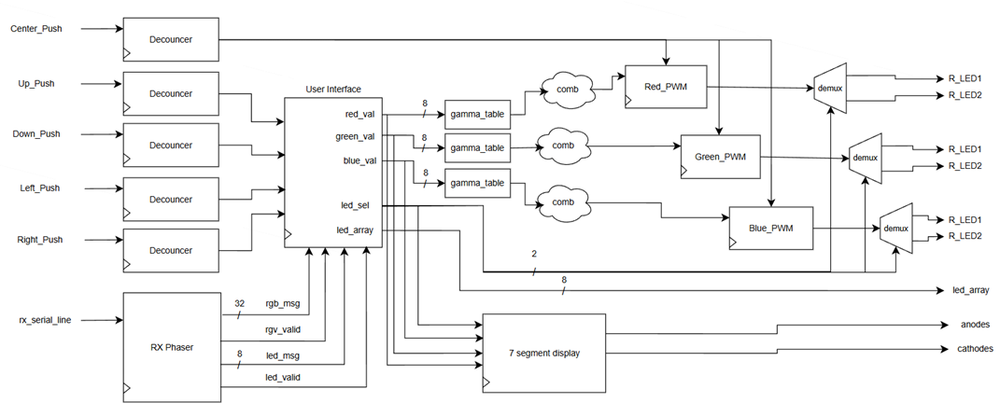

# RGB PWM Controller

UART-controlled RGB LED PWM system implemented on the Nexys A7 FPGA.  
The design receives formatted UART commands, parses RGB values, and drives onboard RGB LEDs using PWM with perceptually correct brightness.

### Demo 

---

## Top Level Micro Architecture

### Components:
- RX Phaser
- User Interface
- Debouncer
- PWM Generator
- Seven-Segment Display
- Gamma Table

---

## Micro Architecture – User Interface

### Key Concept:
- When a valid message is received from the RX Phaser, a MUX loads the new data into internal registers.
- The registers drive both the seven-segment display and combinational logic used to increment or decrement values via user buttons.
- Updated values are written back to the registers every clock cycle.
- A pointer (`ptr`) selects which RGB component or LED value is currently active.

---

## Testbench & Simulations

### Receiving RGB and LED commands and displaying them on the seven-segment display

### PWM Signals

Simulations verify correct UART reception, message parsing, and PWM duty-cycle generation, including rejection of invalid packets.

---

## Elaborated Design

- Clean hierarchy
- No unconnected logic
- Fully synthesizable

---

## Summary

This project implements a complete UART-controlled RGB LED PWM system on FPGA.  
The design combines reliable UART RX reception, ASCII message parsing, sRGB to linear conversion using a gamma table, and parameterized PWM generation.  
The system was fully verified in simulation and validated on hardware, demonstrating stable LED control and user interaction.

